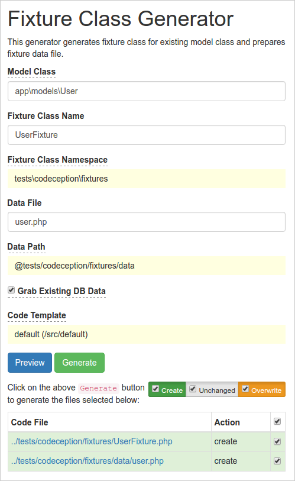

# Fixture class generator for Gii module of Yii2 Framework

The extension allows to generate fixture class on base of existing `ActiveRecord` model class. Also it allows to grab existing records from database into fixture data file.



## Installation

Install with composer:

```bash
composer require --dev elisdn/yii2-gii-fixture-generator
```

or add

```bash
"elisdn/yii2-gii-fixture-generator": "*"
```

to the require section of your `composer.json` file.

Add new generator into your Gii module config:

```php
$config['modules']['gii'] = [
    'class' => 'yii\gii\Module',
    'generators' => [
        'fixture' => [
            'class' => 'elisdn\gii\fixture\Generator',
        ],
    ],
];
```

And add the following line:

```php
Yii::setAlias('@tests', dirname(__DIR__) . '/tests');
```

in top of your `config/web.php` file.